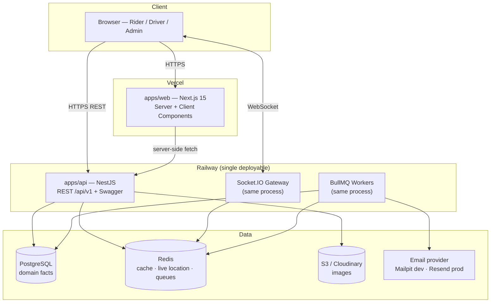

# CholoJai — System Architecture

> **Status:** Draft for review · **Last updated:** 2026-08-05
>
> This document describes how CholoJai is built: the system topology, the
> internal structure of each application, and the Architecture Decision
> Records (ADRs) that justify every significant choice. The product scope
> lives in `product-spec.md`; the domain lives in `domain-model.md`.

---

## 1. System overview



Two deployables. The web app serves marketing pages and dashboard shells;
the API owns all domain logic, realtime, and background jobs. The browser
talks to the API directly (REST + WebSocket) for dynamic data, while Next.js
server components fetch from the API for server-rendered pages.

## 2. Monorepo layout

```
cholojai/
├── apps/
│   ├── web/                  # Next.js 15 — marketing site + all dashboards
│   └── api/                  # NestJS — REST API, Socket.IO, BullMQ workers
├── packages/
│   ├── shared/               # Zod schemas, shared types, constants, enums
│   ├── eslint-config/        # single lint ruleset consumed by both apps
│   └── tsconfig/             # base tsconfig(s), strict mode
├── docs/                     # this documentation
├── docker-compose.yml        # Postgres + Redis + Mailpit for local dev
└── turbo.json
```

`packages/shared` is the keystone: the ride status enum, the fare quote
schema, and every API request/response contract are defined **once** and
imported by both apps. Frontend and backend cannot drift apart, because they
compile against the same types.

## 3. Backend architecture (apps/api)

NestJS **modular monolith** (ADR-002). One module per domain feature:

```
src/
├── modules/
│   ├── auth/           ├── users/          ├── drivers/
│   ├── vehicles/       ├── rides/          ├── fares/
│   ├── payments/       ├── reviews/        ├── coupons/
│   ├── referrals/      ├── notifications/  ├── tracking/   (Socket.IO)
│   ├── admin/          └── content/        (blog, careers, contact — M9)
├── common/             # guards, interceptors, filters, decorators, pipes
├── config/             # typed, validated environment configuration
├── prisma/             # schema, migrations, PrismaService
└── main.ts
```

Layering inside every module, dependencies pointing one way only:

```
Controller (HTTP concerns: routing, status codes, Swagger docs)
   ↓ calls
Service (business logic, state-machine guards, transactions)
   ↓ calls
Repository / PrismaService (persistence only)
```

Rules:

- Controllers never touch Prisma. Services never read `Request` objects.
- Cross-module calls go through the other module's **service** (its public
  API), never its repository. This is what keeps the monolith modular.
- The ride state machine (domain-model §3) is enforced in exactly one place:
  `rides` service's transition guard. No other code writes `ride.status`.
- Every endpoint validates input with a Zod schema from `packages/shared`
  (ADR-005) and is documented in Swagger.

## 4. Frontend architecture (apps/web)

Next.js 15 App Router, feature-based structure:

```
src/
├── app/                    # routes only — thin files that compose features
│   ├── (marketing)/        # landing, safety, fares, blog, careers, contact
│   ├── (auth)/             # login, register, verify, forgot password
│   ├── (rider)/            # booking, ride tracking, history, profile
│   ├── (driver)/           # driver dashboard, vehicles, earnings
│   └── (admin)/            # admin dashboard, approvals, analytics, CMS
├── features/               # the real code: one folder per feature
│   └── booking/
│       ├── components/     # feature-private components
│       ├── hooks/          # React Query hooks for this feature
│       ├── api.ts          # typed API calls (Axios + shared schemas)
│       └── store.ts        # Zustand slice if the feature needs one
├── components/ui/          # design system (shadcn-based, ours)
├── lib/                    # axios instance, query client, utils
└── styles/
```

State management is split by _kind of state_ — using one tool for all three
is the classic junior mistake:

| Kind of state                                | Tool                  | Example                           |
| -------------------------------------------- | --------------------- | --------------------------------- |
| Server state (owned by the API)              | React Query           | rides, profile, quotes            |
| Client UI state (ephemeral, cross-component) | Zustand               | booking wizard step, sidebar open |
| Form state                                   | React Hook Form + Zod | every form                        |

Server Components render everything that doesn't need interactivity
(marketing pages, blog, static dashboard chrome); Client Components are
reserved for the interactive islands (map, booking flow, live tracking).

## 5. Cross-cutting concerns

- **Realtime:** one Socket.IO gateway in the API process. Rooms per ride
  (`ride:{id}`). Driver location pings → Redis (`driver:loc:{id}`, TTL) →
  broadcast to the ride room. Nothing persisted (domain-model D4).
- **Background jobs:** BullMQ queues — `email` (verification, receipts),
  `notifications`, `ride-simulation` (bot-driver movement ticks in demo
  mode). Workers run in-process in v1; the queue boundary means they can be
  split into a separate deployable without code changes.
- **Errors:** one global exception filter maps domain errors → RFC 9457
  problem-details JSON (defined in `api-design.md`). No ad-hoc error shapes.
- **Logging:** structured JSON logs (pino) with a request-id correlation
  header, generated at the edge and propagated into logs and error
  responses.
- **Config:** every environment variable is declared in a Zod schema,
  validated at boot. The app crashes loudly on missing config instead of
  failing mysteriously at 2 a.m.

---

## 6. Architecture Decision Records

### ADR-001 — Monorepo with Turborepo + pnpm workspaces — **Accepted**

- **Context:** Frontend and backend share contracts (DTOs, enums, fare
  rules); separate repos would duplicate them.
- **Decision:** One repository; Turborepo for task orchestration/caching;
  pnpm workspaces for linking.
- **Alternatives:** Two repos (drift risk, double CI); Nx (heavier, more
  opinionated than needed).
- **Consequences:** Atomic cross-stack commits; one CI pipeline; shared
  types make API drift a compile error. Cost: contributors must learn
  workspace basics.

### ADR-002 — Modular monolith, not microservices — **Accepted**

- **Context:** The domain has many features but one small team and no
  independent-scaling requirement.
- **Decision:** Single NestJS deployable with strict module boundaries
  (§3 rules); Socket.IO and BullMQ workers in-process.
- **Alternatives:** Microservices (operational cost, distributed
  transactions, zero benefit at this scale); serverless functions (poor fit
  for WebSockets and long-lived queues).
- **Consequences:** One deploy, simple local dev, easy transactions. The
  module-boundary rules keep extraction possible if scale ever demands it.
  This is the architecture Uber and Amazon _started_ with — services came
  when team size forced them.

### ADR-003 — PostgreSQL + Prisma — **Accepted**

- **Context:** The domain is relational to its core (users↔rides↔vehicles),
  with invariants that want database enforcement.
- **Decision:** PostgreSQL as the single source of truth; Prisma for schema,
  migrations, and type-safe queries; raw SQL where Prisma's abstraction
  falls short (partial unique indexes, geo distance).
- **Alternatives:** MongoDB (wrong shape for relational invariants); TypeORM
  (weaker type story, decorator entity drift); Drizzle (strong, but Prisma's
  migration DX and maturity win for this project).
- **Consequences:** Generated types end-to-end; reviewable migration
  history. Cost: Prisma's abstraction has edges — we accept dropping to SQL
  deliberately, and document each spot.

### ADR-004 — Redis for ephemeral state, BullMQ for jobs — **Accepted**

- **Context:** Live driver locations (D4), caching, rate limiting, and
  background work all need a fast shared store.
- **Decision:** One Redis instance backing: live-location keys with TTL,
  cache, rate-limit counters, and BullMQ queues.
- **Alternatives:** Postgres for everything (bloats the domain store with
  transient writes); in-memory only (lost on restart, breaks multi-instance).
- **Consequences:** Clean fact/transient split; one extra service in Docker
  Compose — acceptable.

### ADR-005 — Zod in `packages/shared` is the single validation source — **Accepted**

- **Context:** The same contract (e.g. "create ride request") must be
  validated in the browser form, the API boundary, and reflected in Swagger.
  Writing it twice (Zod on the front, class-validator on the back) guarantees
  drift.
- **Decision:** Every API contract is a Zod schema in `packages/shared`.
  The web app uses them with React Hook Form; the API consumes them via
  `nestjs-zod` (generating DTO classes + OpenAPI metadata).
- **Alternatives:** class-validator on the backend (the NestJS default —
  but duplicates every rule); tRPC (removes REST/OpenAPI, which we want to
  showcase); GraphQL (see ADR-007).
- **Consequences:** One schema = one truth; frontend and backend validation
  cannot disagree. Cost: `nestjs-zod` is an extra integration layer — small
  and worth it.

### ADR-006 — Maps: Leaflet + OpenStreetMap, OSRM for routing — **Accepted** _(resolves product-spec Q1)_

- **Context:** Booking needs an interactive map, geocoding, and route
  distance/duration for fare quotes — with zero budget and original look.
- **Decision:** Leaflet (via react-leaflet) with OpenStreetMap tiles;
  Nominatim for geocoding; public OSRM API for routing — all behind our own
  API endpoints (`/geo/*`) so the browser never talks to third parties
  directly and the provider is swappable.
- **Alternatives:** Google Maps (key + billing, generic look, ToS limits);
  Mapbox (excellent but key-gated free tier).
- **Consequences:** Keyless dev experience, custom-styled original map UI.
  Cost: public Nominatim/OSRM have rate limits — fine for a demo, and the
  `/geo/*` seam means a paid provider is a config change. Respectful usage
  (caching, debouncing) is mandatory and lands in M6.

### ADR-007 — REST + OpenAPI, versioned under `/api/v1` — **Accepted**

- **Context:** The API must be showcase-quality and consumable by any
  client.
- **Decision:** Resource-oriented REST, URI versioning (`/api/v1`), Swagger
  auto-generated from code + Zod schemas.
- **Alternatives:** GraphQL (flexibility we don't need; hides HTTP
  semantics); tRPC (brilliant DX but couples clients to TypeScript and
  removes the public-API artifact worth showing).
- **Consequences:** Cache-friendly, documented, portfolio-visible API.
  Conventions detailed in `api-design.md`.

### ADR-008 — Auth: JWT access token + rotating refresh token — **Accepted** _(details in M3)_

- **Context:** SPA-style dashboards need stateless auth; long sessions need
  revocability.
- **Decision:** Short-lived JWT access token (~15 min, memory) + rotating
  refresh token (~7 days, httpOnly secure cookie, hashed server-side,
  reuse-detection revokes the family).
- **Alternatives:** Server sessions (simpler, but we want to demonstrate
  token auth); long-lived JWT only (unrevocable — unacceptable).
- **Consequences:** Standard, secure, interview-defensible. Full threat
  model written in M3.

---

### ADR-009 — Refresh tokens are opaque, not JWTs — **Accepted** _(M3.4)_

- **Context:** ADR-008 fixed the two-token shape but left the refresh
  token's own format open. The obvious choice is symmetry: the access
  token is a JWT, so make the refresh token one too.
- **Decision:** The refresh token is 256 bits from the OS CSPRNG, stored
  as a SHA-256 hash in `refresh_tokens` and looked up by that hash. It
  carries no signature and needs no signing key, so the application has
  exactly one JWT secret. Only the access token is a JWT.
- **Rationale:** A JWT's single advantage is validation without a database
  read, and a refresh token cannot take it. Revocation on sign-out, on
  password change, and on detected reuse all require consulting a store on
  every use. Once that read is unavoidable, the signature does no work —
  it adds a second key to rotate, a second set of clock-skew rules, and a
  larger cookie, in exchange for nothing. The database row _is_ the
  token's validity. Auth0, Okta, and the OAuth 2.0 Security BCP land in
  the same place for the same reason.
- **Alternatives:** Signed JWT refresh tokens (rejected — ceremony with no
  benefit, and a second secret is a second thing to leak); JWT carrying
  `familyId` so a pruned row can still be traced (rejected — rows are not
  pruned inside the token's lifetime, so the case does not arise).
- **Consequences:** One secret instead of two. An unauthenticated caller
  can force one indexed lookup per garbage string; rate limiting (M3.6) is
  the answer, since verifying a signature also costs CPU and would not
  have prevented it. `JWT_REFRESH_SECRET` was removed from the
  environment before it ever shipped.

---

### ADR-010 — Rotation grace window over strict reuse detection — **Accepted** _(M3.5)_

- **Context:** Refresh-token rotation makes any replay of an exchanged
  token evidence of theft. But an honest client replays too: two tabs, or
  a mobile client retrying a request that timed out in a tunnel, both send
  the same token twice. Strict detection cannot tell those apart from an
  attacker and signs the user out.
- **Decision:** A replay arriving strictly within
  `REFRESH_ROTATION_GRACE_SECONDS` (default 10) of its own rotation returns
  `REFRESH_TOKEN_STALE` and revokes nothing; the client retries with the
  cookie the winning request already set. Outside the window it is
  `REFRESH_TOKEN_REUSED` and the family dies. The window is half-open so a
  configured 0 genuinely means zero.
- **Alternatives:** Strict, zero-tolerance detection (rejected as the
  default — false positives would be routine on Bangladeshi mobile
  networks, and a security control users learn to route around protects
  nothing; still available via config). Returning the same successor to
  the loser (impossible — we store only the hash, never the plaintext, so
  a successor cannot be re-issued after the fact). Serialising refreshes
  per user with a lock (adds a distributed-lock dependency to solve a
  problem a timestamp comparison solves).
- **Consequences:** A deliberate ten-second window in which a replay raises
  no alarm. Bounded and small: the attacker still has to hold a live token,
  and the next refresh outside the window detects them. Rotation is atomic
  in one transaction — a conditional `UPDATE … WHERE revoked_at IS NULL`
  guarantees exactly one successor per token even under concurrent requests.

---

### ADR-011 — Sliding refresh window inside an absolute session ceiling — **Accepted** _(M3.5)_

- **Context:** If each rotation grants a fresh seven days, an account that
  refreshes weekly is never asked for a password again. Rotation would have
  made sessions _less_ bounded than the fixed seven-day token it replaced.
- **Decision:** Each successor expires at
  `min(now + REFRESH_TTL_DAYS, familyStartedAt + REFRESH_ABSOLUTE_TTL_DAYS)`.
  Seven days of inactivity ends a session; thirty days of activity ends it
  too. The family's start is an indexed `MIN(created_at)` lookup.
- **Alternatives:** Pure sliding (rejected — unbounded sessions). Pure
  absolute (rejected — logs out daily users every week for no security
  gain). A denormalised `family_started_at` column on every row (rejected —
  duplicated data that can drift, to save one indexed aggregate per refresh).
- **Consequences:** One extra read per refresh. The config schema rejects
  `REFRESH_TTL_DAYS > REFRESH_ABSOLUTE_TTL_DAYS` in every environment,
  because that combination is not risky so much as incoherent: the clamp
  would silently ignore the sliding value.

---

### ADR-012 — A first-party rate limiter, not `@nestjs/throttler` — **Accepted** _(M3.6)_

- **Context:** Every unauthenticated endpoint needs throttling, and
  `@nestjs/throttler` with a Redis storage adapter is the default answer in
  this ecosystem. Choosing otherwise needs a reason.
- **Decision:** ~250 lines of our own: a `RateLimitStore` port, a Redis
  adapter running a sliding-window-counter Lua script, a global
  `RateLimitGuard`, and `@RateLimit()` / `@SkipRateLimit()` decorators.
- **Rationale:** Three things we need are awkward or absent in the library.
  (1) Composite keys — login is limited per email _and_ per IP with
  different windows, which means subclassing the guard and overriding
  `getTracker` per route, i.e. writing a custom guard anyway. (2) Explicit
  fail-open with an alertable warning; the library's storage errors
  propagate. (3) Hashing the identifier before it becomes a Redis key, so
  the limiter holds no personal data. Once a custom guard is required, the
  dependency is supplying a counter we would wrap regardless.
- **Alternatives:** `@nestjs/throttler` (rejected above; it remains the
  right default for simpler needs, and this ADR exists so the deviation is
  a decision rather than an oversight). A fixed-window counter (rejected —
  a caller can spend the budget twice across a window boundary, which on a
  login endpoint is the difference between throttling a guessing run and
  waving it through in bursts). A sliding log of timestamps (rejected —
  memory grows with request volume, and volume is what spikes during the
  abuse it defends against).
- **Consequences:** Two integers per caller regardless of traffic. The
  weighting assumes the previous window's requests were evenly spread, so a
  caller who front-loads is measured slightly leniently — bounded, small,
  and the same trade Cloudflare makes. Check and increment run as one Lua
  script, for the same reason refresh rotation is one transaction: a
  read-then-write is not a check. The script needs a real Redis to test, so
  those suites are gated on `REDIS_TEST_URL` and CI runs a service container.

---

### ADR-013 — Flat roles and one composite `@Auth()` decorator — **Accepted** _(M3.7)_

- **Context:** Routes need role checks, and Nest's building blocks are a
  guard plus a metadata decorator plus `@UseGuards` in the right order.
- **Decision:** `RolesGuard` checks role _containment_ with no hierarchy,
  and `@Auth(...roles)` composes `UseGuards(JwtAuthGuard, RolesGuard)`,
  `@Roles(...)`, and the Swagger security annotations into one decorator.
- **Rationale:** Two things. First, hierarchy is a privilege bug waiting to
  happen — ADMIN implying DRIVER would put administrators into driver
  matching, which nobody intends; roles are additive per decision D1, so
  containment is also the honest model. Second, the hand-written form has a
  silent failure mode: `@Roles(ADMIN)` without the guards records a
  requirement that nothing enforces, and the route _reads_ as protected. An
  API in which the mistake cannot be expressed beats a convention that says
  not to make it.
- **Alternatives:** A global `RolesGuard` with `@Public()` opt-out
  (rejected for the same reason as global authentication in M3.4 —
  forgetting to remove an exemption is silent, and this API is public at the
  edges and protected in the middle). CASL or a policy engine (rejected —
  no caller yet needs attribute or ownership rules; when ride ownership
  arrives in M5 it will be a distinct check, not more roles).
- **Consequences:** `RolesGuard` still fails closed when `request.user` is
  absent, because "unreachable" is a claim about today's code and the cost
  of being wrong is an open admin endpoint. Ownership — "is this _your_
  ride" — is explicitly out of scope here; RBAC answers what a role may do,
  not which rows it may touch.

### ADR-014 — Tailwind v4 with a CSS-first theme, no `tailwind.config.js` — **Accepted** _(M4.1)_

- **Context:** `apps/web` needs a styling layer, and a design system lands
  on top of it in M4.2. Tailwind v4 moved configuration out of JavaScript
  and into CSS via `@theme`, so the choice is no longer only "which
  framework" but "where do design tokens live".
- **Decision:** Tailwind v4 as a PostCSS plugin, with the theme declared in
  `src/styles/globals.css` using `@theme`. No `tailwind.config.js`.
- **Rationale:** Tokens declared in CSS _are_ the custom properties the
  browser receives, rather than a JavaScript object compiled into custom
  properties. That removes a class of confusion where the config says one
  thing and the cascade does another, and it makes every token readable in
  devtools and overridable per media query or data attribute — which is
  precisely the mechanism dark mode needs in M4.2.
- **Alternatives:** Tailwind v3 with a JS config (rejected — a major
  version behind on a greenfield project, and it makes the theme a
  build-time artifact the browser never sees). CSS Modules or vanilla-extract
  (rejected — both are good, but shadcn/ui is Tailwind-based and this
  product needs a component library more than it needs styling purity).
  Runtime CSS-in-JS such as styled-components (rejected — fundamentally at
  odds with Server Components, which are the default rendering mode here).
- **Consequences:** shadcn/ui components must be taken at their Tailwind v4
  revisions. There is no JavaScript object to import tokens from, so
  anything needing a colour value in TypeScript reads the custom property
  instead — which is the correct direction of dependency regardless.

### ADR-015 — One root ESLint config with a scoped React layer — **Accepted** _(M4.1)_

- **Context:** `next lint` was removed in Next.js 16, so the framework no
  longer supplies a lint entry point, and the React rules have to attach to
  the existing flat config somehow.
- **Decision:** `@cholojai/eslint-config/next` exports a `nextConfig(files)`
  factory; the root config calls it scoped to `apps/web/**/*.{ts,tsx}`.
  There is no ESLint config file inside `apps/web`.
- **Rationale:** Flat config does not cascade. A second config file in
  `apps/web` would mean `eslint .` from the root silently stops applying
  React rules to the web app — green lint, no coverage, and nothing to say
  so. A factory keeps the file patterns with the consumer that knows them
  and the rules with the package that owns them.
- **Alternatives:** A ready-made array exported from the package (rejected —
  it would either apply React rules to every NestJS file or hard-code
  `apps/web` into a package that has no business knowing it exists).
  Per-app config files (rejected for the silent-gap reason above).
  `FlatCompat` shims (unnecessary — all four plugins ship native flat
  config in current versions).
- **Consequences:** A second React app means one more call to the factory
  rather than a new config file. `@next/next/no-html-link-for-pages` is
  switched off: it hunts for a Pages Router directory an App-Router-only
  codebase does not have, and warns about its own configuration on every
  run.

---

## 7. Environments

|                  | Local                | Production           |
| ---------------- | -------------------- | -------------------- |
| Web              | `next dev`           | Vercel               |
| API              | `nest start --watch` | Railway              |
| Postgres / Redis | Docker Compose       | Railway managed      |
| Email            | Mailpit (Compose)    | Resend free tier     |
| Images           | Cloudinary free tier | Cloudinary → S3 seam |

One command (`pnpm dev` after `docker compose up -d`) runs the full stack
locally. CI (GitHub Actions) runs lint, typecheck, tests, and build on every
PR; deploys are triggered from `main`.
