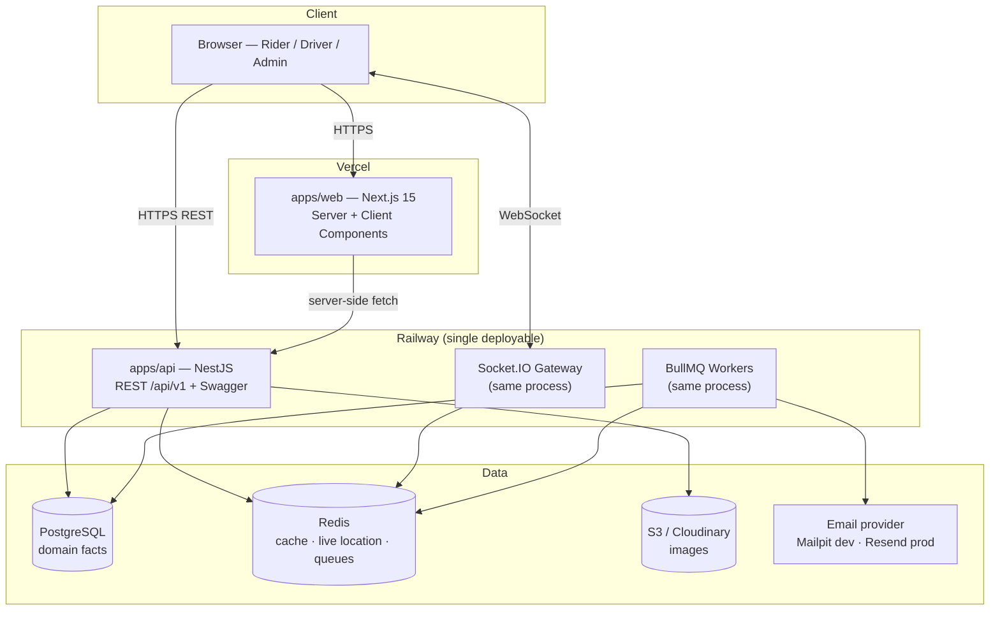

# CholoJai — System Architecture

> **Status:** Draft for review · **Last updated:** 2026-08-05
>
> This document describes how CholoJai is built: the system topology, the
> internal structure of each application, and the Architecture Decision
> Records (ADRs) that justify every significant choice. The product scope
> lives in `product-spec.md`; the domain lives in `domain-model.md`.

---

## 1. System overview



Two deployables. The web app serves marketing pages and dashboard shells;
the API owns all domain logic, realtime, and background jobs. The browser
talks to the API directly (REST + WebSocket) for dynamic data, while Next.js
server components fetch from the API for server-rendered pages.

## 2. Monorepo layout

```
cholojai/
├── apps/
│   ├── web/                  # Next.js 15 — marketing site + all dashboards
│   └── api/                  # NestJS — REST API, Socket.IO, BullMQ workers
├── packages/
│   ├── shared/               # Zod schemas, shared types, constants, enums
│   ├── eslint-config/        # single lint ruleset consumed by both apps
│   └── tsconfig/             # base tsconfig(s), strict mode
├── docs/                     # this documentation
├── docker-compose.yml        # Postgres + Redis + Mailpit for local dev
└── turbo.json
```

`packages/shared` is the keystone: the ride status enum, the fare quote
schema, and every API request/response contract are defined **once** and
imported by both apps. Frontend and backend cannot drift apart, because they
compile against the same types.

## 3. Backend architecture (apps/api)

NestJS **modular monolith** (ADR-002). One module per domain feature:

```
src/
├── modules/
│   ├── auth/           ├── users/          ├── drivers/
│   ├── vehicles/       ├── rides/          ├── fares/
│   ├── payments/       ├── reviews/        ├── coupons/
│   ├── referrals/      ├── notifications/  ├── tracking/   (Socket.IO)
│   ├── admin/          └── content/        (blog, careers, contact — M9)
├── common/             # guards, interceptors, filters, decorators, pipes
├── config/             # typed, validated environment configuration
├── prisma/             # schema, migrations, PrismaService
└── main.ts
```

Layering inside every module, dependencies pointing one way only:

```
Controller (HTTP concerns: routing, status codes, Swagger docs)
   ↓ calls
Service (business logic, state-machine guards, transactions)
   ↓ calls
Repository / PrismaService (persistence only)
```

Rules:

- Controllers never touch Prisma. Services never read `Request` objects.
- Cross-module calls go through the other module's **service** (its public
  API), never its repository. This is what keeps the monolith modular.
- The ride state machine (domain-model §3) is enforced in exactly one place:
  `rides` service's transition guard. No other code writes `ride.status`.
- Every endpoint validates input with a Zod schema from `packages/shared`
  (ADR-005) and is documented in Swagger.

## 4. Frontend architecture (apps/web)

Next.js 15 App Router, feature-based structure:

```
src/
├── app/                    # routes only — thin files that compose features
│   ├── (marketing)/        # landing, safety, fares, blog, careers, contact
│   ├── (auth)/             # login, register, verify, forgot password
│   ├── (rider)/            # booking, ride tracking, history, profile
│   ├── (driver)/           # driver dashboard, vehicles, earnings
│   └── (admin)/            # admin dashboard, approvals, analytics, CMS
├── features/               # the real code: one folder per feature
│   └── booking/
│       ├── components/     # feature-private components
│       ├── hooks/          # React Query hooks for this feature
│       ├── api.ts          # typed API calls (Axios + shared schemas)
│       └── store.ts        # Zustand slice if the feature needs one
├── components/ui/          # design system (shadcn-based, ours)
├── lib/                    # axios instance, query client, utils
└── styles/
```

State management is split by *kind of state* — using one tool for all three
is the classic junior mistake:

| Kind of state | Tool | Example |
| --- | --- | --- |
| Server state (owned by the API) | React Query | rides, profile, quotes |
| Client UI state (ephemeral, cross-component) | Zustand | booking wizard step, sidebar open |
| Form state | React Hook Form + Zod | every form |

Server Components render everything that doesn't need interactivity
(marketing pages, blog, static dashboard chrome); Client Components are
reserved for the interactive islands (map, booking flow, live tracking).

## 5. Cross-cutting concerns

- **Realtime:** one Socket.IO gateway in the API process. Rooms per ride
  (`ride:{id}`). Driver location pings → Redis (`driver:loc:{id}`, TTL) →
  broadcast to the ride room. Nothing persisted (domain-model D4).
- **Background jobs:** BullMQ queues — `email` (verification, receipts),
  `notifications`, `ride-simulation` (bot-driver movement ticks in demo
  mode). Workers run in-process in v1; the queue boundary means they can be
  split into a separate deployable without code changes.
- **Errors:** one global exception filter maps domain errors → RFC 9457
  problem-details JSON (defined in `api-design.md`). No ad-hoc error shapes.
- **Logging:** structured JSON logs (pino) with a request-id correlation
  header, generated at the edge and propagated into logs and error
  responses.
- **Config:** every environment variable is declared in a Zod schema,
  validated at boot. The app crashes loudly on missing config instead of
  failing mysteriously at 2 a.m.

---

## 6. Architecture Decision Records

### ADR-001 — Monorepo with Turborepo + pnpm workspaces — **Accepted**

- **Context:** Frontend and backend share contracts (DTOs, enums, fare
  rules); separate repos would duplicate them.
- **Decision:** One repository; Turborepo for task orchestration/caching;
  pnpm workspaces for linking.
- **Alternatives:** Two repos (drift risk, double CI); Nx (heavier, more
  opinionated than needed).
- **Consequences:** Atomic cross-stack commits; one CI pipeline; shared
  types make API drift a compile error. Cost: contributors must learn
  workspace basics.

### ADR-002 — Modular monolith, not microservices — **Accepted**

- **Context:** The domain has many features but one small team and no
  independent-scaling requirement.
- **Decision:** Single NestJS deployable with strict module boundaries
  (§3 rules); Socket.IO and BullMQ workers in-process.
- **Alternatives:** Microservices (operational cost, distributed
  transactions, zero benefit at this scale); serverless functions (poor fit
  for WebSockets and long-lived queues).
- **Consequences:** One deploy, simple local dev, easy transactions. The
  module-boundary rules keep extraction possible if scale ever demands it.
  This is the architecture Uber and Amazon *started* with — services came
  when team size forced them.

### ADR-003 — PostgreSQL + Prisma — **Accepted**

- **Context:** The domain is relational to its core (users↔rides↔vehicles),
  with invariants that want database enforcement.
- **Decision:** PostgreSQL as the single source of truth; Prisma for schema,
  migrations, and type-safe queries; raw SQL where Prisma's abstraction
  falls short (partial unique indexes, geo distance).
- **Alternatives:** MongoDB (wrong shape for relational invariants); TypeORM
  (weaker type story, decorator entity drift); Drizzle (strong, but Prisma's
  migration DX and maturity win for this project).
- **Consequences:** Generated types end-to-end; reviewable migration
  history. Cost: Prisma's abstraction has edges — we accept dropping to SQL
  deliberately, and document each spot.

### ADR-004 — Redis for ephemeral state, BullMQ for jobs — **Accepted**

- **Context:** Live driver locations (D4), caching, rate limiting, and
  background work all need a fast shared store.
- **Decision:** One Redis instance backing: live-location keys with TTL,
  cache, rate-limit counters, and BullMQ queues.
- **Alternatives:** Postgres for everything (bloats the domain store with
  transient writes); in-memory only (lost on restart, breaks multi-instance).
- **Consequences:** Clean fact/transient split; one extra service in Docker
  Compose — acceptable.

### ADR-005 — Zod in `packages/shared` is the single validation source — **Accepted**

- **Context:** The same contract (e.g. "create ride request") must be
  validated in the browser form, the API boundary, and reflected in Swagger.
  Writing it twice (Zod on the front, class-validator on the back) guarantees
  drift.
- **Decision:** Every API contract is a Zod schema in `packages/shared`.
  The web app uses them with React Hook Form; the API consumes them via
  `nestjs-zod` (generating DTO classes + OpenAPI metadata).
- **Alternatives:** class-validator on the backend (the NestJS default —
  but duplicates every rule); tRPC (removes REST/OpenAPI, which we want to
  showcase); GraphQL (see ADR-007).
- **Consequences:** One schema = one truth; frontend and backend validation
  cannot disagree. Cost: `nestjs-zod` is an extra integration layer — small
  and worth it.

### ADR-006 — Maps: Leaflet + OpenStreetMap, OSRM for routing — **Accepted** *(resolves product-spec Q1)*

- **Context:** Booking needs an interactive map, geocoding, and route
  distance/duration for fare quotes — with zero budget and original look.
- **Decision:** Leaflet (via react-leaflet) with OpenStreetMap tiles;
  Nominatim for geocoding; public OSRM API for routing — all behind our own
  API endpoints (`/geo/*`) so the browser never talks to third parties
  directly and the provider is swappable.
- **Alternatives:** Google Maps (key + billing, generic look, ToS limits);
  Mapbox (excellent but key-gated free tier).
- **Consequences:** Keyless dev experience, custom-styled original map UI.
  Cost: public Nominatim/OSRM have rate limits — fine for a demo, and the
  `/geo/*` seam means a paid provider is a config change. Respectful usage
  (caching, debouncing) is mandatory and lands in M6.

### ADR-007 — REST + OpenAPI, versioned under `/api/v1` — **Accepted**

- **Context:** The API must be showcase-quality and consumable by any
  client.
- **Decision:** Resource-oriented REST, URI versioning (`/api/v1`), Swagger
  auto-generated from code + Zod schemas.
- **Alternatives:** GraphQL (flexibility we don't need; hides HTTP
  semantics); tRPC (brilliant DX but couples clients to TypeScript and
  removes the public-API artifact worth showing).
- **Consequences:** Cache-friendly, documented, portfolio-visible API.
  Conventions detailed in `api-design.md`.

### ADR-008 — Auth: JWT access token + rotating refresh token — **Accepted** *(details in M3)*

- **Context:** SPA-style dashboards need stateless auth; long sessions need
  revocability.
- **Decision:** Short-lived JWT access token (~15 min, memory) + rotating
  refresh token (~7 days, httpOnly secure cookie, hashed server-side,
  reuse-detection revokes the family).
- **Alternatives:** Server sessions (simpler, but we want to demonstrate
  token auth); long-lived JWT only (unrevocable — unacceptable).
- **Consequences:** Standard, secure, interview-defensible. Full threat
  model written in M3.

---

## 7. Environments

| | Local | Production |
| --- | --- | --- |
| Web | `next dev` | Vercel |
| API | `nest start --watch` | Railway |
| Postgres / Redis | Docker Compose | Railway managed |
| Email | Mailpit (Compose) | Resend free tier |
| Images | Cloudinary free tier | Cloudinary → S3 seam |

One command (`pnpm dev` after `docker compose up -d`) runs the full stack
locally. CI (GitHub Actions) runs lint, typecheck, tests, and build on every
PR; deploys are triggered from `main`.
