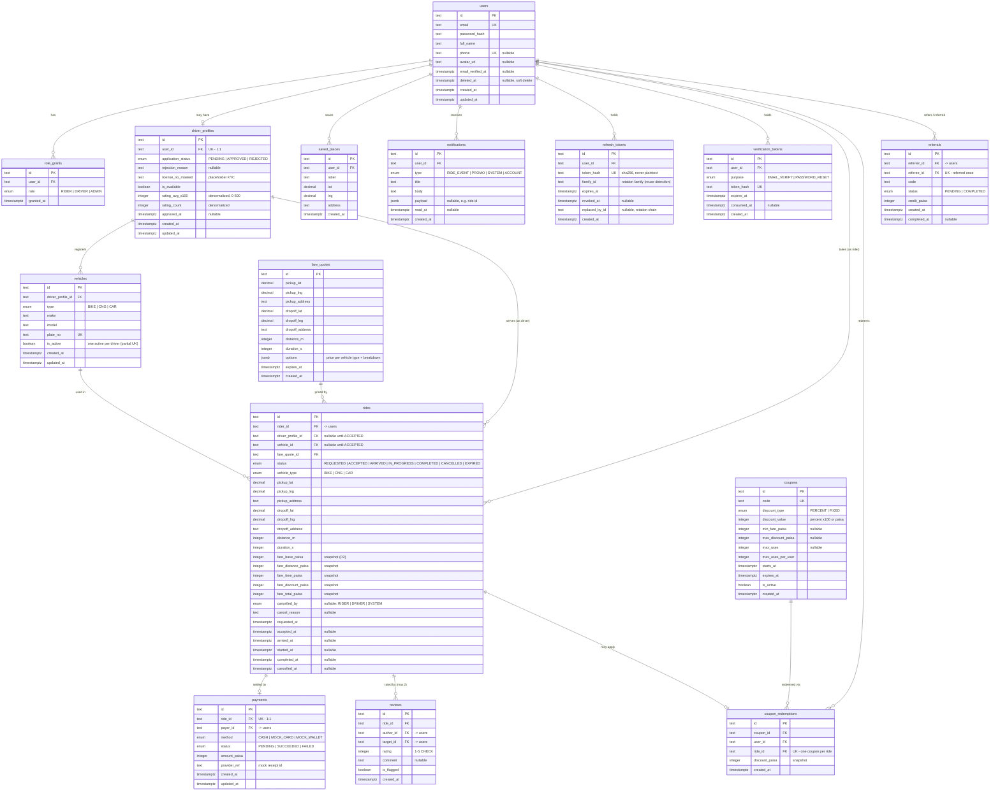

# CholoJai — Database Design (Core ERD)

> **Status:** Draft for review · **Last updated:** 2026-08-05
>
> Relational implementation of `domain-model.md`. This covers the **core
> domain** (identity, drivers, rides, payments, reviews, growth). Content
> tables (blog, careers, contact) are reserved and will be designed in M9;
> auth token tables are included here because M3 needs them.
> Implementation is Prisma; every change to this design ships as a reviewed
> migration.

---

## 1. Conventions

| Concern | Convention | Why |
| --- | --- | --- |
| Primary keys | `TEXT` CUIDs (`cuid2`), generated app-side | Non-guessable (no `/rides/42` enumeration), safe to expose in URLs, no cross-table collision. Auto-increment integers leak volume and invite IDOR probing. |
| Table names | `snake_case` plural via Prisma `@@map` (`users`, `driver_profiles`) | SQL convention; Prisma models stay PascalCase singular. |
| Money | `INTEGER` in **paisa** (1 BDT = 100 paisa) | Floats cannot represent decimal currency exactly (`0.1 + 0.2 ≠ 0.3`). Integer minor units is the industry standard (Stripe stores cents). |
| Coordinates | `DECIMAL(9,6)` lat / lng pairs | ~11 cm precision; exact storage. PostGIS is overkill for v1 (ADR note below). |
| Timestamps | `TIMESTAMPTZ`, UTC, `created_at` everywhere, `updated_at` where rows mutate | Timezone bugs are eliminated at the storage layer; render in local time at the edge. |
| Enums | PostgreSQL native enums via Prisma | Invalid states unrepresentable *in the database*, not just in TypeScript. |
| Deletion | Soft delete **only** on `users` (`deleted_at`); hard delete elsewhere | Rides/payments are history — never deleted. Users must be deactivatable while their rides remain (FK integrity + audit). |
| FKs & indexes | Every FK indexed; `ON DELETE RESTRICT` default | Postgres does not auto-index FK columns — forgetting this is the most common silent performance bug. RESTRICT by default: deleting a user must not cascade-destroy ride history. |

---

## 2. Entity-relationship diagram



---

## 3. Design notes — the decisions inside the diagram

### N1 — `role_grants` as a table, not a column

An enum array or a `role` column on `users` would work today, but a grant
*row* carries metadata (granted_at, and later granted_by) and makes
adding/revoking a role an insert/delete instead of a column rewrite. Query
"is user X a driver?" hits `(user_id, role)` — covered by a composite unique
index (which doubles as "can't grant the same role twice").

### N2 — Invariants 2 & 3 as partial unique indexes

"A rider has at most one non-terminal ride" cannot be a plain unique index
on `rider_id` (riders take many rides over time). PostgreSQL's **partial
unique index** solves it exactly:

```sql
CREATE UNIQUE INDEX one_active_ride_per_rider
  ON rides (rider_id)
  WHERE status IN ('REQUESTED','ACCEPTED','ARRIVED','IN_PROGRESS');

CREATE UNIQUE INDEX one_active_ride_per_driver
  ON rides (driver_profile_id)
  WHERE status IN ('ACCEPTED','ARRIVED','IN_PROGRESS');
```

Even if application code has a race (two concurrent booking requests), the
database refuses the second insert. Defense in depth: the service checks
first for a friendly error; the index guarantees correctness. Prisma cannot
express partial indexes in its schema DSL — this ships as a **raw SQL
migration**, exactly the documented escape hatch from ADR-003.

The same trick enforces "one active vehicle per driver":
`UNIQUE (driver_profile_id) WHERE is_active = true`.

### N3 — Fare snapshot as five columns, not JSON

D2 says the fare breakdown is copied onto the ride. Five typed integer
columns (`fare_base/_distance/_time/_discount/_total_paisa`) instead of a
`jsonb` blob because analytics ("average discount this month") stays plain
SQL, and `CHECK (fare_total_paisa = fare_base_paisa + fare_distance_paisa +
fare_time_paisa - fare_discount_paisa)` lets the database verify our
arithmetic forever. `fare_quotes.options` *is* jsonb, by contrast — quotes
are short-lived offers, never aggregated.

### N4 — `rating_avg_x100` integer, not float

A 4.87 average stored as `487`. Same reasoning as money: exact, cheap, and
`CHECK (rating_avg_x100 BETWEEN 0 AND 500)` keeps it sane. Updated
transactionally with each review insert.

### N5 — Reviews: uniqueness per direction + a paired FK subtlety

`UNIQUE (ride_id, author_id)` enforces "one review per direction" (domain
invariant 5). `author_id` and `target_id` both reference `users` — the
rides service validates that both were actually *on* the ride; the DB can't
cheaply express that, and this is a documented example of an invariant that
lives in the service layer, not the schema.

### N6 — Token tables store hashes, never tokens

`refresh_tokens.token_hash` and `verification_tokens.token_hash` are SHA-256
digests. A database leak must not hand out working sessions or reset links.
`family_id` + `replaced_by_id` implement rotation with **reuse detection**:
presenting an already-rotated token revokes the whole family (ADR-008).

### N7 — What is deliberately absent

- **No `location_updates` table** — domain-model D4; live GPS lives in Redis.
- **No PostGIS** — we need point storage and haversine distance, not
  geospatial joins. `DECIMAL` pairs + a SQL haversine function suffice;
  PostGIS is the documented upgrade path if geo queries ever grow.
- **No generic `addresses` table** — pickup/dropoff are denormalized text +
  coords on the ride (they're historical snapshots, same logic as fares).
- **Content tables** (`blog_posts`, `career_listings`, `job_applications`,
  `contact_messages`) — reserved, designed in M9.

---

## 4. Index plan (beyond PKs and unique constraints)

| Index | Serves |
| --- | --- |
| `rides (rider_id, requested_at DESC)` | rider ride-history page |
| `rides (driver_profile_id, requested_at DESC)` | driver history/earnings |
| `rides (status)` | matching + admin live monitor |
| `rides (requested_at)` | analytics date ranges |
| `notifications (user_id, read_at)` | unread badge + inbox |
| `reviews (target_id)` | driver rating recalculation |
| `coupon_redemptions (coupon_id)`, `(user_id)` | usage-limit checks |
| `refresh_tokens (user_id)`, `(family_id)` | session listing, family revocation |
| every FK column | joins + RESTRICT checks (see Conventions) |

Rule going forward: **no index without a query that needs it** — each future
index lands in the migration that ships the query it serves. Unused indexes
are a write-amplification tax.

---

## 5. Migration policy

1. Schema changes only via `prisma migrate dev` → reviewed SQL in
   `prisma/migrations/`. No `db push` outside throwaway spikes.
2. Raw SQL (partial indexes, CHECK constraints) lives in migrations with a
   comment linking back to the design note here (N2, N3…).
3. Seed script provides: 1 admin, demo riders, approved bot drivers with
   vehicles (product-spec Q2), sample coupons.
4. Destructive migrations require a written up/down note in the PR.
