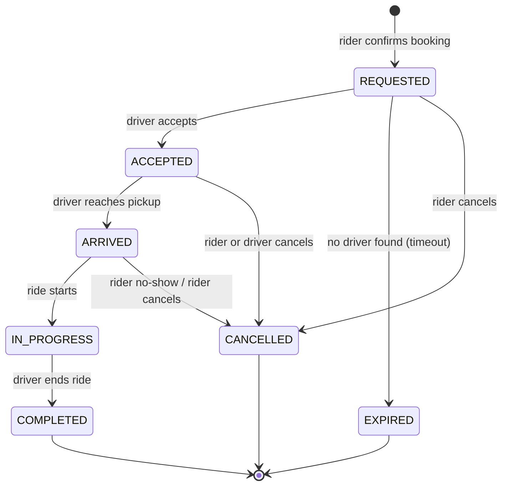

# CholoJai — Domain Model

> **Status:** Draft for review · **Last updated:** 2026-08-05
>
> This document defines the entities of the CholoJai domain, the relationships
> between them, and the **ubiquitous language** — the single vocabulary used
> in code, database, API, and conversation. If a term is not defined here, it
> is not part of the domain. The relational implementation of this model lives
> in `database-erd.md`.

---

## 1. Ubiquitous language

Terms we use — and the near-synonyms we explicitly do **not** use:

| Term | Definition | We do NOT say |
| --- | --- | --- |
| **User** | A person with an account. Identity + authentication only. | account, member |
| **Role** | A capability set granted to a user: `RIDER`, `DRIVER`, `ADMIN`. One user may hold several. | user type |
| **Rider** | A user acting under the `RIDER` role. Not a separate entity — a role in context. | passenger, customer |
| **Driver** | A user with an approved **driver profile**, acting under the `DRIVER` role. | partner, captain |
| **Driver profile** | Driver-specific extension of a user: application status, availability, aggregate rating. | driver account |
| **Vehicle** | A registered means of transport owned by a driver: `BIKE`, `CNG`, or `CAR`. | car (as generic term) |
| **Ride** | The central aggregate: one rider's journey from pickup to destination, with its full lifecycle. | trip, booking, order |
| **Fare quote** | A priced offer (per vehicle type) for a proposed route, valid briefly before booking. | estimate (in code) |
| **Fare** | The agreed amount, **snapshotted onto the ride** at booking time. | price, cost |
| **Payment** | The (mock) settlement of a completed ride's fare. | transaction |
| **Review** | A post-ride rating (1–5) + optional comment. Mutual: rider→driver and driver→rider. | feedback |
| **Coupon** | An admin-created discount code a rider applies at booking. | promo, voucher |
| **Referral** | An invitation from one user to another that grants both a credit. | invite |
| **Saved place** | A rider's named location (Home, Campus…). | favorite |
| **Notification** | An in-app (and sometimes email) message about a domain event. | alert |

Naming rule for code and schema: these exact terms, in these exact meanings.
`Ride`, not `Trip`. `fareQuote`, not `estimate`.

---

## 2. Core decisions

### D1 — One account, multiple roles *(ratified 2026-08-05)*

A single `User` holds identity and credentials. Roles are granted
independently; a rider can *become* a driver by submitting a driver
application, without a second account.

- **Why:** no duplicated auth/profile logic; matches reality (drivers also
  ride); a clean RBAC story.
- **Consequence:** driver-specific data must NOT live on `User`. It lives on
  `DriverProfile` (1:1 with `User`, exists only for drivers). `User` stays
  lean; each role's extension data hangs off it.

### D2 — Fare is snapshotted onto the ride

A fare quote references current pricing rules. At booking, the chosen quote's
amount **and its full breakdown** (base, per-km, per-minute, surge, discount)
are copied onto the ride.

- **Why:** pricing rules change; a ride's fare must be immutable history. If
  we only stored a reference to the pricing rule, editing tomorrow's rates
  would silently rewrite yesterday's receipts.
- **This is deliberate denormalization** — the classic exception to "always
  normalize": *historical financial records are snapshots, not references.*

### D3 — Cancellation is one state with metadata, not many states

`CANCELLED` is a single terminal state carrying `cancelledBy`
(RIDER | DRIVER | SYSTEM) and a reason code — rather than
`CANCELLED_BY_RIDER`, `CANCELLED_BY_DRIVER`, … as separate states.

- **Why:** the *machine* behaves identically for all cancellations (ride
  over, driver freed); only the *reporting* differs. States encode behavior;
  metadata encodes detail. Fewer states = fewer transitions to guard.

### D4 — Live location is ephemeral, not a table

Driver GPS pings during a ride flow through Socket.IO and are cached in
Redis (last-known position). They are **not** written to PostgreSQL.

- **Why:** thousands of inserts per ride with near-zero read value after the
  ride ends. The database stores *domain facts* (pickup, dropoff, distance);
  Redis handles *transient state*. If we later want route replay, we add an
  explicit, sampled `ride_route_points` table — as a decision, not a default.

---

## 3. The ride lifecycle (state machine)

| State | Meaning | Terminal? |
| --- | --- | --- |
| `REQUESTED` | Rider confirmed; system is matching a driver | no |
| `ACCEPTED` | Driver assigned and en route to pickup | no |
| `ARRIVED` | Driver at pickup point, waiting | no |
| `IN_PROGRESS` | Rider on board, journey underway | no |
| `COMPLETED` | Journey finished; fare payable; reviews unlocked | yes |
| `CANCELLED` | Ended early by rider, driver, or system (see D3) | yes |
| `EXPIRED` | Matching timed out with no driver | yes |

**Invariants** (must be enforced in code, in one place):

1. Transitions not drawn above are illegal. `COMPLETED → CANCELLED` must be
   unrepresentable, not merely unlikely.
2. A driver has at most one ride in a non-terminal state.
3. A rider has at most one ride in a non-terminal state.
4. `Payment` may exist only for a `COMPLETED` ride.
5. `Review` may be written only for a `COMPLETED` ride, once per direction.
6. Every transition is timestamped (`requestedAt`, `acceptedAt`, `arrivedAt`,
   `startedAt`, `completedAt` / `cancelledAt`) — the audit trail is the set
   of timestamps, and analytics (e.g. pickup wait time) falls out for free.

---

## 4. Entities and relationships

### Identity & access

- **User** — email, hashed password, name, phone, avatar, verification state.
  *Has many* roles (via grant), *has one optional* DriverProfile, *has many*
  saved places, notifications, rides (as rider), reviews (authored and
  received).
- **RoleGrant** — links a user to a role (`RIDER` granted at signup; `DRIVER`
  granted on application approval; `ADMIN` granted manually/seeded).

### Driver side

- **DriverProfile** — 1:1 with User. Application status
  (`PENDING → APPROVED | REJECTED`), availability flag, license placeholder,
  aggregate rating (denormalized average + count, maintained on new reviews —
  same snapshot rationale as D2: computing AVG over all reviews on every
  driver-card render doesn't scale).
- **Vehicle** — belongs to a DriverProfile. Type (`BIKE`/`CNG`/`CAR`), make,
  model, plate number, active flag. A driver may register several vehicles
  but has one active at a time.

### The ride aggregate

- **Ride** — the center of the domain. References rider (User), driver
  (DriverProfile, nullable until `ACCEPTED`), vehicle (nullable until
  `ACCEPTED`). Carries pickup and dropoff (lat, lng, address text), status,
  the fare snapshot (D2), distance and duration, the coupon applied (if
  any), and the lifecycle timestamps.
- **FareQuote** — short-lived: route, per-vehicle-type prices, expiry.
  Referenced at booking; its chosen line becomes the ride's fare snapshot.
- **Payment** — 1:1 with a completed ride. Mock provider behind a
  `PaymentProvider` interface (the seam from the spec's "Won't have" list).
  Method (`CASH`, `MOCK_CARD`, `MOCK_WALLET`), status, receipt reference.
- **Review** — belongs to a ride; author and target users; rating 1–5,
  comment, moderation flag. Exactly two possible per ride (one per
  direction), enforced by a uniqueness rule on (ride, author).

### Growth & engagement

- **Coupon** — code, discount type (percent/fixed), constraints (expiry, max
  uses, min fare), active flag. **CouponRedemption** links coupon → user →
  ride, enforcing per-user usage limits.
- **Referral** — referrer, referee, code, status, credit granted.
- **Notification** — recipient, type, payload, read flag.
- **SavedPlace** — owner, label, lat/lng, address.

### Content (peripheral — modeled fully in M9)

`BlogPost`, `CareerListing`, `JobApplication`, `ContactMessage`. These hang
off the same User/Role system (admins author posts) but sit outside the ride
domain; we list them now so the ERD reserves them, and detail them when M9
begins.

---

## 5. Aggregate boundaries (why they matter)

The **Ride** is an *aggregate root*: Payment and Reviews are only ever
created *through* a ride, and the state-machine invariants (§3) are enforced
at this boundary — one service owns every transition. Nothing else in the
codebase may set `ride.status` directly.

Likewise **User** is the root for RoleGrants and DriverProfile: role changes
go through user-centric operations (application approval), never by writing
a grant row from arbitrary code.

This is the Domain-Driven "thinking where beneficial" from our brief — we
borrow the aggregate concept because it tells us where invariants live,
without importing the full DDD ceremony (no event sourcing, no CQRS) that a
project of this size doesn't need.
